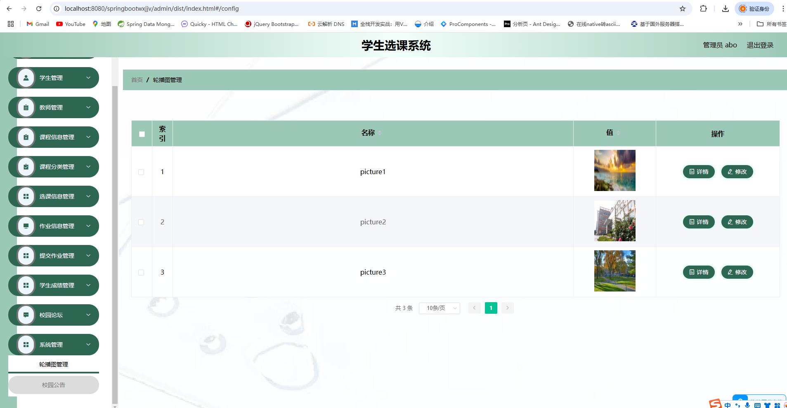

# 一、系统说明

基于springboot+element的学生选课系统,系统功能齐全, 代码简洁易懂，适合小白学编程,课程设计，毕业设计。

# 二、系统架构

######      前端：vue| elementui

######      后端：springboot | mybatis 

######      环境：jdk1.8+ | mysql8.0 | maven

# 三、代码及数据库

# 四、系统角色

###### 管理员、学生 、老师

# 五、相关功能介绍

#### 1).管理端

###### 1.管理端登录

###### 2.首页

###### 3.个人中心->修改密码

###### 4.学生管理->学生

###### 5.教师管理->教师

###### 6.课程信息管理->课程信息

###### 7.课程分类管理->课程分类

###### 8.选课信息管理->选课信息

###### 9.作业信息管理->作业信息

###### 10.提交作业管理->提交作业

###### 11.学生成绩管理->学生成绩

###### 12.校园论坛

###### 13.系统管理->轮播图管理

###### 14.系统管理->校园公告

#### 2).教师端

###### 1.个人中心->修改密码

###### 2.个人中心->个人信息

###### 3.课程信息管理->课程信息

###### 4.选课信息管理->选课信息

###### 5.作业信息管理->作业信息

###### 6.提交作业管理->提交作业

###### 7.学生成绩管理->学生成绩

#### 3).学生端

###### 1.首页

包含课程信息展示和课程信息展示

###### 2.课程信息

###### 3.校园论坛

###### 4.校园公告

###### 5.个人中心->登录

###### 6.个人中心->资料

###### 7.课程详情->选课、收藏

